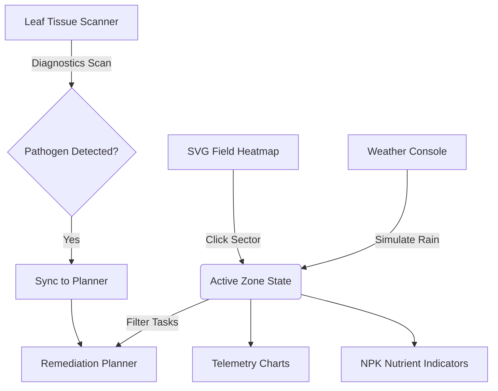

# 🌾 FarmHUD - Precision Crop Health & Diagnostics Dashboard

[](https://react.dev/)
[](https://www.typescriptlang.org/)
[](https://vite.dev/)
[](https://tailwindcss.com/)
[](https://opensource.org/licenses/MIT)

FarmHUD is an interactive, premium single-page dashboard designed for modern smart farming. By combining **real-time soil telemetry tracking**, **simulated AI leaf tissue analysis**, and **integrated remediation planners**, it provides a visual command center (HUD) that empowers growers to make data-driven agronomic decisions.

---

## 🎯 Detailed Project Objective

Traditional farming relies heavily on calendar schedules and uniform treatments, leading to chemical runoff, crop diseases going unnoticed, and critical water waste. 

The objective of **FarmHUD** is to demonstrate how modern web technologies (React + TypeScript + Tailwind CSS) can interface with IoT sensor streams and computer vision diagnostics to create a unified **Operational Control Center**. It aggregates fragmented agronomic details into a single pane of glass, closing the gap between raw data collection and physical field action.

---

## 🚜 How FarmHUD Helps Agriculture

FarmHUD addresses four core pillars of precision farming:

### 1. Precision Irrigation (Water Resource Management)
* **The Problem**: Over-irrigation wastes fresh water and causes soil erosion, while under-irrigation induces plant stress and reduces harvest yields.
* **FarmHUD's Solution**: The interactive field map and SVG telemetry line charts allow farmers to monitor zone-specific moisture curves. Farmers can automate irrigation zones rather than flooding the entire field, saving water and keeping soil at optimal humidity.

### 2. Early Fungal & Disease Mitigation (Quarantine)
* **The Problem**: Leaf pathogens like Late Blight and Rust spread rapidly, destroying entire yields if not detected within days.
* **FarmHUD's Solution**: The **AI Crop Disease Diagnostics** simulator models a mobile/drone leaf scanning system. By diagnosing leaf spot patterns in seconds, farmers can immediately identify the specific pathogen (e.g. *Phytophthora infestans*) and quarantine or treat infected zones before spores disperse.

### 3. Soil Conservation & Targeted Fertilization (NPK Balance)
* **The Problem**: Blanket fertilizer application exhausts soil microbiomes, poisons local groundwater with nitrate runoff, and is financially inefficient.
* **FarmHUD's Solution**: Visualized Nitrogen (N), Phosphorus (P), and Potassium (K) mineral levels highlight exact deficiencies. Farmers apply fertilizer supplements only to depleted zones, reducing chemical usage and preserving long-term soil viability.

### 4. Direct Actionability (Closed-Loop Workflow)
* **The Problem**: Diagnostics and checklists are often disconnected, causing critical field recommendations to be delayed or forgotten.
* **FarmHUD's Solution**: Features a **Sync to Planner** pathway. When the AI scans a leaf and determines treatment, it automatically injects tasks (e.g. *"Apply copper-based organic fungicides"*) into the active zone's remediation list.

---

## 💻 Technical Architecture & Data Flow

FarmHUD is architected for speed, low memory footprints, and clean code:



* **Tailwind CSS v4 Integration**: Utilizes the `@tailwindcss/vite` compiler plugin for lightning-fast CSS builds directly bundled in the Vite pipeline, avoiding duplicate parser processes.
* **Vanilla SVG Charts**: Replaces bulky external charting libraries with lightweight, responsive SVGs styled dynamically via Tailwind, keeping the bundle size down to ~240kB.
* **Strict Type Safety**: Written using TypeScript's `verbatimModuleSyntax` flags, separating type imports explicitly to prevent runtime compiler bloating.

---

## 🚀 How to Run the App

### Prerequisites
* [Node.js](https://nodejs.org/) (v18 or higher recommended)

### Installation
Clone the repository and install the dependencies:
```bash
# Install package dependencies
npm install
```

### Run Locally
Start the development server:
```bash
# Launch Vite HMR development server
npm run dev
```
Open **[http://localhost:5173/](http://localhost:5173/)** to preview the dashboard.

### Production Build
Compile and bundle the production assets:
```bash
# Build production bundle
npm run build
```
Compiled assets will be outputted to the `dist/` directory, optimized and ready for static file hosting.
